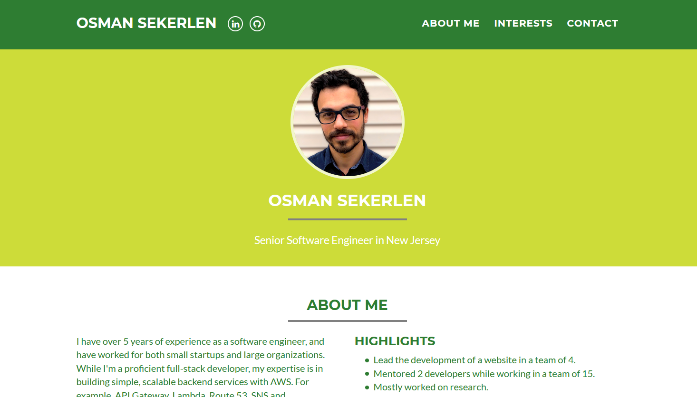

# How to Make Your Own Website for Free

Please ask any questions from [Issues at the top](https://github.com/pegasuspect/pegasuspect.github.io/issues/new?assignees=pegasuspect&labels=question&template=question.md&title=Question%20Title). I am eager to receive feedback and see where I can improve this project.

## How to create your website for free

1. [Install Jekyll.](https://jekyllrb.com/docs/installation/)
2. Place your photo in `/img/profile.png`
3. (Optional) Update the favicon `/img/icon.png`
4. Edit `_config.yml` to give your name, email address, social media contacts, etc. You can also update the color scheme.
5. `_includes` folder is basically content part of your pages. 
    - You can edit content in `/_includes/about_me.html` and `/_includes/interests.html`
6. `_layouts` is where you keeep the repeating parts of your pages like the template or the html wrapper.
    - You can also edit this part to use different javascript libraries or frameworks.
    - You can redesign this in React even!
7. Buy a domain name from [GoDaddy](https://www.godaddy.com/) or [NameCheap](https://www.namecheap.com/)
8. Follow [this guide](https://docs.github.com/en/pages/configuring-a-custom-domain-for-your-github-pages-site/managing-a-custom-domain-for-your-github-pages-site) to use a custom domain for your free github website.
    - Put your domain into [CNAME file.](./CNAME) starting with www.
    - You might also want to contact you domain provider about the `dig` command.
    - After DNS settings are done with your domain provider, [build your website](https://jekyllrb.com/docs/step-by-step/01-setup/#build) and upload your code to github.

